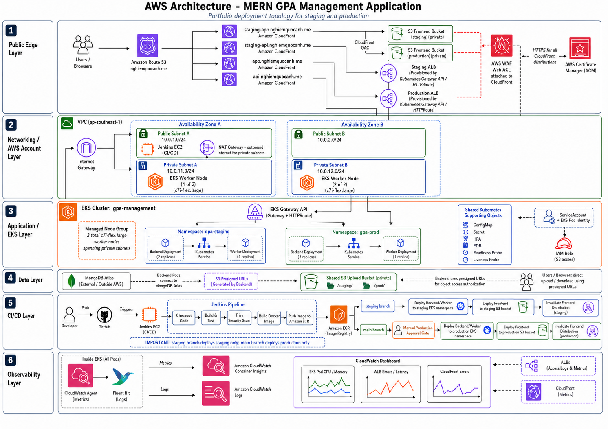
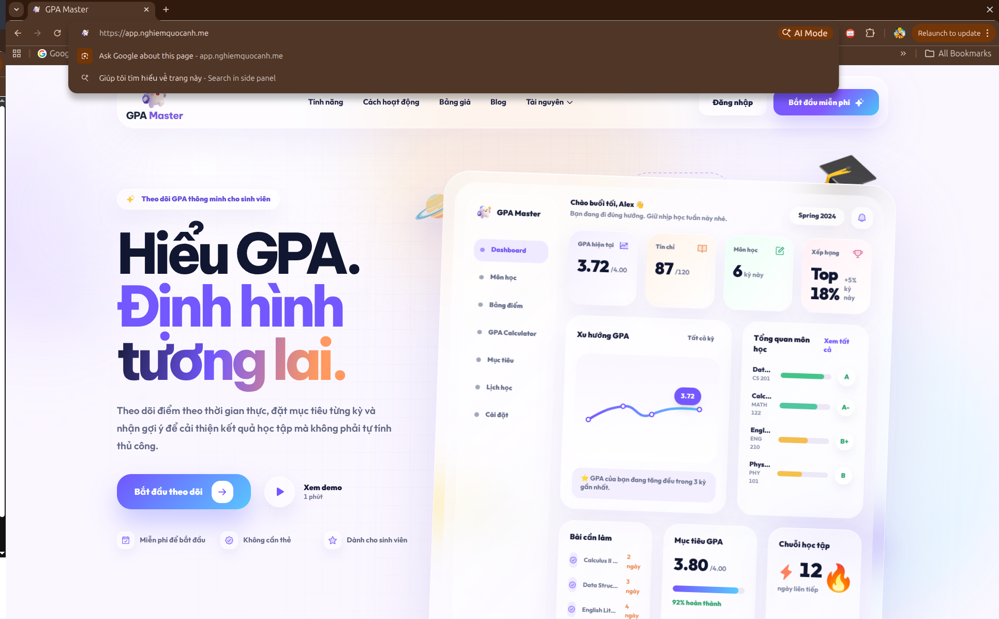
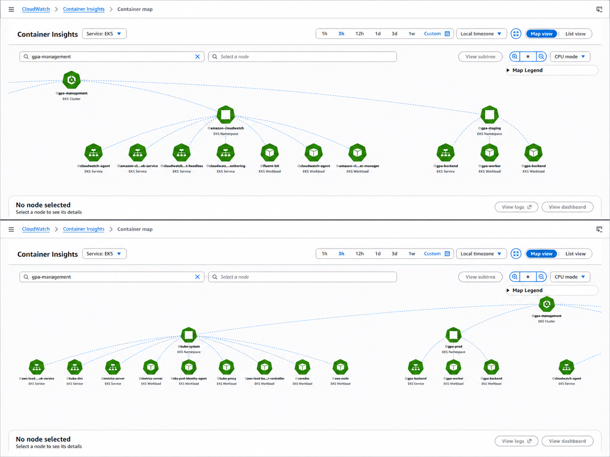
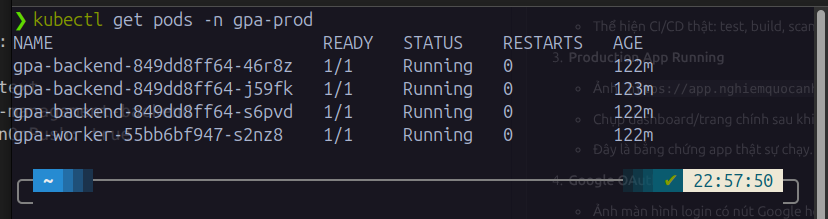
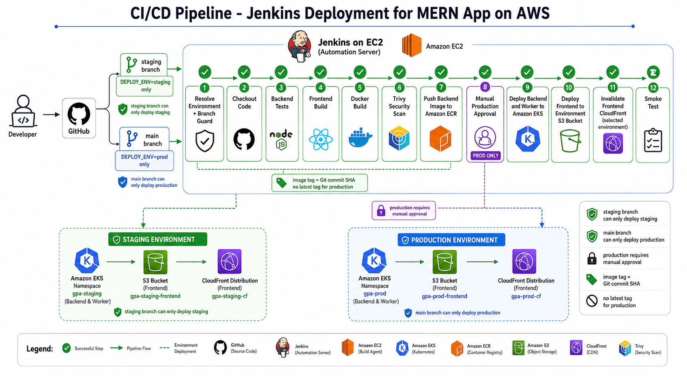
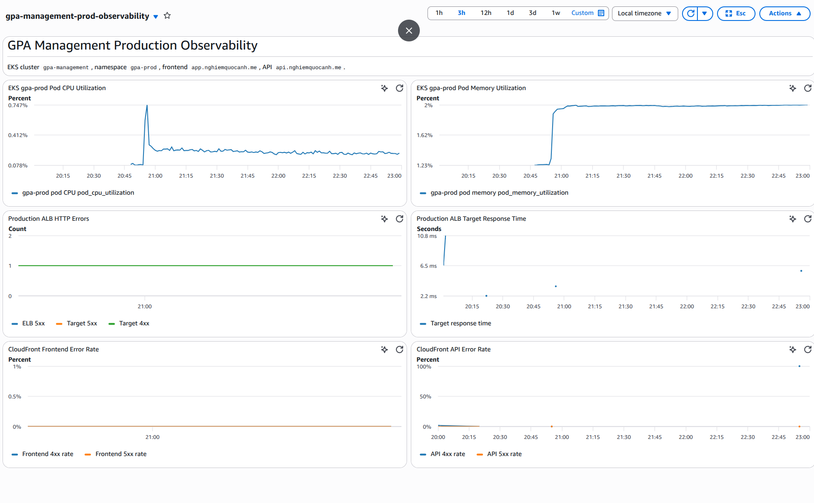
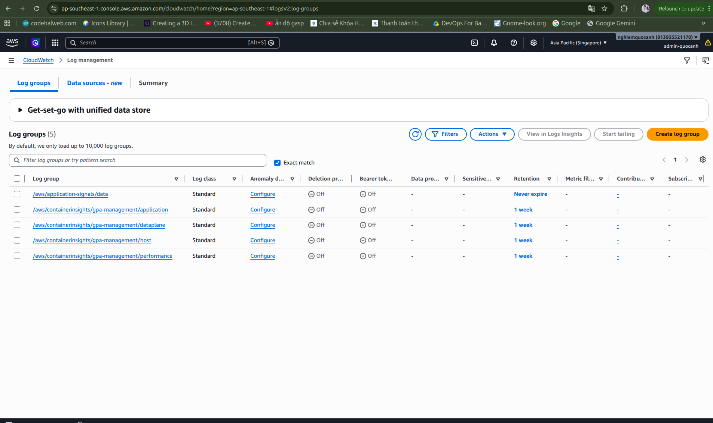

# GPA Management - AWS EKS Deployment Portfolio

This repository demonstrates a production-like deployment of a MERN GPA/student management application on AWS. The main focus is not only the app itself, but the infrastructure and operations work around it: AWS networking, EKS, Kubernetes manifests, CloudFront/S3 frontend hosting, ALB routing, IAM, Jenkins CI/CD, CloudWatch logging/monitoring, rollback, and cost awareness.

## Main Focus

This project is centered on two DevOps areas:

1. **Deploying a MERN application to AWS**
   - Route 53 custom domains.
   - CloudFront CDN for frontend and API.
   - Private S3 buckets for React build artifacts.
   - ALB-backed API traffic into EKS.
   - MongoDB Atlas as managed database.
   - S3 presigned URLs for upload/download traffic.

2. **Running the backend on Amazon EKS**
   - Separate `gpa-staging` and `gpa-prod` namespaces.
   - Kubernetes Deployment, Service, ConfigMap, Secret, HPA, PDB, Gateway, HTTPRoute.
   - Readiness/liveness probes.
   - Resource requests/limits.
   - EKS Pod Identity for S3 access without static AWS keys.
   - Rolling updates and rollback tooling.

CI/CD and monitoring are included as operational layers, but the core of the project is the AWS/EKS deployment design.

## Architecture



Public traffic is split into frontend and API paths:

```text
Frontend:
User -> Route 53 -> CloudFront -> private S3 frontend bucket

API:
User -> Route 53 -> CloudFront API -> ALB -> EKS Gateway API -> Kubernetes Service -> backend pods

Uploads:
User -> backend API -> S3 presigned URL -> shared S3 upload bucket
```

## Live Environments

| Environment | Frontend | API | Kubernetes namespace | Git branch |
| --- | --- | --- | --- | --- |
| Staging | `https://staging-app.nghiemquocanh.me` | `https://staging-api.nghiemquocanh.me` | `gpa-staging` | `staging` |
| Production | `https://app.nghiemquocanh.me` | `https://api.nghiemquocanh.me` | `gpa-prod` | `main` |



## AWS Infrastructure Setup

| Area | Actual setup |
| --- | --- |
| Region | `ap-southeast-1` |
| ACM for CloudFront | `us-east-1` certificate for `nghiemquocanh.me` and subdomains |
| VPC | 1 project VPC, CIDR design based on `10.0.0.0/16` |
| Availability Zones | 2 AZs |
| Public subnets | 2 public subnets |
| Private subnets | 2 private subnets |
| Internet egress | 1 Internet Gateway and 1 NAT Gateway |
| EKS cluster | `gpa-management`, Kubernetes `1.34` |
| Node group | 1 managed node group: `ng-ad034c86` |
| Worker nodes | 2 private EC2 workers, `c7i-flex.large` |
| Jenkins runner | 1 EC2 instance, `c7i-flex.large`, public subnet |
| ALB | 2 internet-facing ALBs, one for staging and one for production |
| CloudFront | 4 distributions: staging app, staging API, production app, production API |
| S3 | 3 buckets: staging frontend, production frontend, shared uploads |
| ECR | 1 private backend repository with scan-on-push |
| Route 53 | 4 app/API records |
| CloudWatch | 4 Container Insights log groups with 7-day retention and 1 production dashboard |
| WAF | CloudFront-scope edge security layer |
| Database | MongoDB Atlas with separated staging and production users/databases |

## AWS Services Used

| Layer | Service | Purpose |
| --- | --- | --- |
| DNS | Route 53 | Maps app/API subdomains to CloudFront |
| HTTPS | ACM | TLS certificate for CloudFront aliases |
| CDN / Edge | CloudFront | Serves frontend and API through separate distributions |
| Edge security | AWS WAF | Protects public CloudFront traffic |
| Static frontend | S3 | Stores React/Vite build output |
| Private S3 access | CloudFront OAC | Keeps frontend buckets private |
| API entry | ALB | Routes public API traffic into EKS |
| Kubernetes | EKS | Runs backend API and worker workloads |
| Registry | ECR | Stores backend Docker images |
| IAM | IAM roles, EKS access entries, Pod Identity | Gives Jenkins and pods least-key AWS access |
| Upload storage | S3 presigned URLs | Reduces backend file-transfer load |
| Observability | CloudWatch Logs, Container Insights, Dashboard | Central logs and metrics |

## EKS And Kubernetes Setup

Production backend workload:

| Kubernetes object | Production setup |
| --- | --- |
| Namespace | `gpa-prod` |
| Backend Deployment | `3` replicas |
| Worker Deployment | `1` replica |
| Rolling update | `maxSurge: 1`, `maxUnavailable: 0` |
| Readiness probe | `/readyz` |
| Liveness probe | `/healthz` |
| Backend resources | requests `300m CPU / 384Mi`, limits `1 CPU / 1Gi` |
| HPA | min `3`, max `6`, target CPU `65%` |
| PDB | `minAvailable: 2` |
| ServiceAccount | `gpa-backend-sa` |
| AWS access | EKS Pod Identity to S3 IAM role |
| API routing | Gateway API + HTTPRoute -> Kubernetes Service |

Staging workload:

| Kubernetes object | Staging setup |
| --- | --- |
| Namespace | `gpa-staging` |
| Backend Deployment | `2` replicas |
| Worker Deployment | `1` replica |
| API routing | Dedicated Gateway/HTTPRoute and ALB |
| Config | `APP_ENV=staging` |

CloudWatch Container Insights shows the actual EKS runtime map for the cluster, namespaces, services, and workloads:



Kubernetes CLI verification:



## Why The Frontend Runs On S3/CloudFront

React builds into static files. Running static frontend assets as pods in EKS would waste worker-node CPU and memory. This project uses:

```text
Vite build -> S3 private bucket -> CloudFront -> Route 53 custom domain
```

Benefits:

- Cheaper than running frontend pods.
- Faster global delivery through CDN.
- Private S3 bucket using CloudFront access.
- Easy deployment by syncing build files and invalidating CloudFront cache.

## CI/CD With Jenkins

Jenkins is the deployment automation layer. It runs on EC2 and deploys both EKS workloads and frontend assets.



Pipeline flow:

```text
GitHub -> Jenkins on EC2
  -> Resolve environment and branch guard
  -> Backend tests
  -> Frontend build
  -> Docker build
  -> Trivy security scan
  -> Push backend image to ECR
  -> Production approval
  -> Deploy backend/worker to EKS
  -> Deploy frontend to S3
  -> Invalidate CloudFront
  -> Smoke test
```

Branch rules:

| Branch | Target | Rule |
| --- | --- | --- |
| `staging` | Staging | Can deploy only `gpa-staging` |
| `main` | Production | Can deploy only `gpa-prod` and requires manual approval |

## Monitoring And Logging

Monitoring is intentionally placed after the deployment architecture because it supports operations rather than defining the core app topology.



Implemented:

- EKS CloudWatch Observability add-on.
- CloudWatch Agent for Container Insights metrics.
- Fluent Bit for application/container logs.
- CloudWatch dashboard for production EKS, ALB, and CloudFront signals.
- Log retention set to 7 days for cost control.

Key signals:

- Pod CPU and memory.
- Backend pod restarts.
- ALB 4xx/5xx and target response time.
- CloudFront frontend/API error rate.
- Backend and worker logs.



## Security And Production-Like Practices

- No real `.env` files committed.
- MongoDB URI, JWT secret, Google OAuth secret, and AWS credentials are not committed.
- Jenkins uses an EC2 IAM role instead of long-lived AWS keys.
- Backend pods use EKS Pod Identity for S3 access.
- Frontend S3 buckets stay private behind CloudFront.
- Upload/download traffic uses S3 presigned URLs.
- Backend container runs as a non-root user.
- Trivy image scanning runs in Jenkins.
- Production deployment requires manual approval.
- ECR images use Git commit SHA tags instead of `latest`.

## Operations Scripts

| Script | Purpose |
| --- | --- |
| `scripts/deploy/build-push-backend.sh` | Build and push backend image to ECR |
| `scripts/deploy/deploy-k8s.sh` | Deploy backend and worker to EKS |
| `scripts/deploy/deploy-frontend-s3.sh` | Build frontend, upload to S3, invalidate CloudFront |
| `scripts/deploy/smoke-test.sh` | Verify API health |
| `scripts/deploy/rollout-history.sh` | Inspect Kubernetes rollout state |
| `scripts/deploy/rollback-k8s.sh` | Guarded rollback for staging/production |
| `scripts/deploy/aws-cost-inventory.sh` | Read-only inventory of cost-sensitive AWS resources |

## Core Code References

| File or directory | What it demonstrates |
| --- | --- |
| [Jenkinsfile](./Jenkinsfile) | CI/CD pipeline stages, environment guard, Trivy scan, ECR push, EKS/S3/CloudFront deployment |
| [Backend Dockerfile](./source/backend/Dockerfile) | Production backend image build, dependency install, non-root runtime user |
| [Production Kubernetes manifests](./k8s/prod) | Namespace, Deployment, Service, ConfigMap, HPA, PDB, Gateway API, HTTPRoute, ServiceAccount |
| [Staging Kubernetes manifests](./k8s/staging) | Staging namespace and deployment configuration separated from production |
| [Deployment scripts](./scripts/deploy) | Repeatable build, deploy, smoke test, rollback, and AWS cost inventory commands |
| [Terraform reference](./infra/terraform) | Reference IaC structure for AWS modules and environment configuration |

## Infrastructure As Code Status

The AWS environment for this portfolio was intentionally provisioned step by step with the AWS Console and AWS CLI to learn each service boundary clearly: VPC, subnets, NAT Gateway, EKS, ALB, CloudFront, S3, Route 53, IAM, WAF, and CloudWatch.

Terraform reference modules are included under [infra/terraform](./infra/terraform), but the next production hardening step is to migrate all manual AWS infrastructure provisioning into Terraform so the environment can be recreated consistently from code.

## Future Improvements

- Migrate all manually provisioned AWS infrastructure to Terraform for reproducible IaC.
- Split Terraform state by environment, for example `staging` and `production`.
- Add a remote Terraform backend with S3 state storage and DynamoDB state locking.
- Add a pull-request workflow that runs `terraform fmt`, `terraform validate`, and `terraform plan`.
- Move runtime Kubernetes secrets to AWS Secrets Manager with External Secrets Operator.

## Documentation

| Document | Content |
| --- | --- |
| [AWS Architecture Deep Dive](./docs/aws-architecture.md) | AWS service map, VPC/EKS topology, staging/prod separation |
| [Jenkins CI/CD Deep Dive](./docs/cicd-jenkins.md) | Pipeline stages, branch guard, image tagging, production approval |
| [Monitoring And Logging](./docs/monitoring-logging.md) | CloudWatch Logs, Container Insights, dashboard, Logs Insights queries |
| [Operations Runbook](./docs/operations-runbook.md) | Health checks, rollout history, rollback, cost inventory |

## Local Development

Backend:

```bash
cd source/backend
npm ci
npm test
npm start
```

Frontend:

```bash
cd source/frontend
npm ci
VITE_API_URL=http://localhost:5000 npm run dev
```

Environment examples:

```text
source/backend/.env.production.example
k8s/staging/secret.example.yaml
k8s/prod/secret.example.yaml
```
