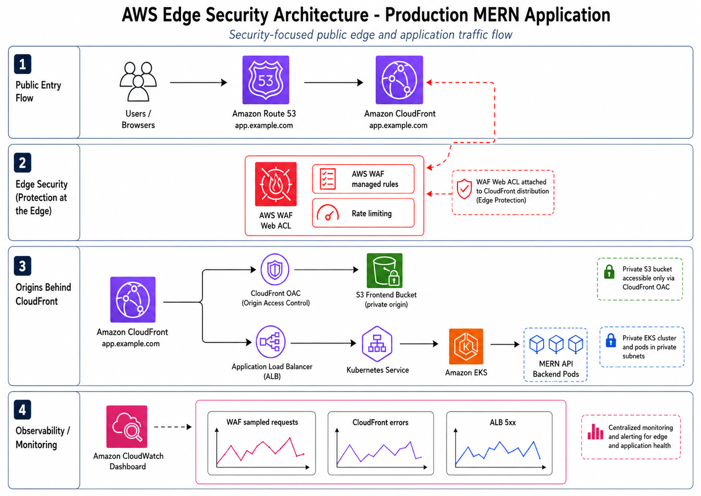

# AWS Architecture Deep Dive

This document explains the AWS services used by the GPA Management project and how staging and production are separated.

## Architecture Diagram


## High-Level Flow

```text
User
  |
  v
Route 53
  |
  +------------------------------------+------------------------------------+
  |                                    |                                    |
  v                                    v                                    v
CloudFront staging app/API             CloudFront production app/API        AWS WAF edge layer
  |                                    |
  |                                    +--> Production frontend -> private S3 prod bucket
  |                                    |
  |                                    +--> Production API -> prod ALB -> EKS Gateway API
  |                                                          |
  |                                                          v
  |                                                   gpa-prod namespace
  |
  +--> Staging frontend -> private S3 staging bucket
  |
  +--> Staging API -> staging ALB -> EKS Gateway API -> gpa-staging namespace

EKS backend pods -> MongoDB Atlas
EKS backend pods -> S3 shared uploads bucket by presigned URL
GitHub -> Jenkins EC2 -> ECR -> EKS/S3/CloudFront
EKS -> CloudWatch Agent + Fluent Bit -> CloudWatch Logs, Container Insights, Dashboard
```

## Actual Resource Topology

The current environment is not a single demo server. It is a multi-layer AWS setup with isolated staging and production entry points.

| Area | Actual setup |
| --- | --- |
| AWS region | `ap-southeast-1` |
| ACM region for CloudFront | `us-east-1` |
| VPC | 1 project VPC, created with AWS VPC Wizard, planned around `10.0.0.0/16` |
| Public subnets | 2 public subnets: `subnet-0658f50f34edd2a24`, `subnet-0bbbc4e31cbe573e3` |
| Private subnets | 2 private subnets: `subnet-0f8ad10338bfa3da2`, `subnet-01f8a571043d46f44` |
| NAT Gateway | 1 NAT Gateway: `nat-09ed78a4c4e07da6f` |
| EKS cluster | 1 cluster: `gpa-management`, Kubernetes `1.34` |
| Node group | 1 managed node group: `ng-ad034c86` |
| EKS workers | 2 private EC2 worker nodes, `c7i-flex.large` |
| Jenkins | 1 EC2 instance, `gpa-jenkins`, `c7i-flex.large`, public subnet, 30GB gp3 root volume |
| ALB | 2 internet-facing ALBs, one for staging Gateway and one for production Gateway |
| CloudFront | 4 distributions: staging app, staging API, production app, production API |
| S3 | 3 buckets: staging frontend, production frontend, shared uploads |
| ECR | 1 private backend repository with scan-on-push |
| Route 53 | 4 main records: staging app, staging API, production app, production API |
| CloudWatch Logs | 4 Container Insights log groups, all with 7-day retention |
| CloudWatch Dashboard | 1 production dashboard: EKS pod CPU/memory, ALB errors/latency, CloudFront errors |
| WAF | CloudFront-scope WAF layer prepared/managed for edge protection |

## Public Entry Points

| Environment | Frontend | API | ALB |
| --- | --- | --- | --- |
| Staging | `staging-app.nghiemquocanh.me` | `staging-api.nghiemquocanh.me` | `k8s-gpastagi-gpagatew-ee1c216c0d` |
| Production | `app.nghiemquocanh.me` | `api.nghiemquocanh.me` | `k8s-gpaprod-gpagatew-dd90f439f3` |

Production frontend evidence:


## CloudFront Distributions

| Distribution | Alias | Purpose |
| --- | --- | --- |
| `E2C8SH021V74FV` | `staging-app.nghiemquocanh.me` | Staging frontend CDN |
| `EF21E4NLB3PCN` | `staging-api.nghiemquocanh.me` | Staging API edge |
| `EEU2J9BQJ0VDT` | `app.nghiemquocanh.me` | Production frontend CDN |
| `E2R5BM402W58OY` | `api.nghiemquocanh.me` | Production API edge |

## Storage Layout

| Bucket | Purpose |
| --- | --- |
| `gpa-management-staging-frontend-813935521170-ap-southeast-1-an` | Staging React build artifacts |
| `gpa-management-prod-frontend-813935521170-ap-southeast-1-an` | Production React build artifacts |
| `gpa-management-shared-uploads-813935521170-ap-southeast-1-an` | Shared upload storage with environment prefixes |

## Environment Separation

| Layer | Staging | Production |
| --- | --- | --- |
| Git branch | `staging` | `main` |
| Kubernetes namespace | `gpa-staging` | `gpa-prod` |
| Frontend domain | `staging-app.nghiemquocanh.me` | `app.nghiemquocanh.me` |
| API domain | `staging-api.nghiemquocanh.me` | `api.nghiemquocanh.me` |
| Frontend S3 bucket | Dedicated staging bucket | Dedicated production bucket |
| Frontend CDN | Dedicated CloudFront distribution | Dedicated CloudFront distribution |
| API CDN | Dedicated CloudFront distribution | Dedicated CloudFront distribution |
| ALB | Dedicated staging ALB | Dedicated production ALB |
| MongoDB Atlas | Staging user/database | Production user/database |
| Jenkins behavior | Automatic deployment | Manual approval before deployment |

## AWS Services Inventory

| Service | Purpose | How it is used |
| --- | --- | --- |
| Route 53 | DNS | Hosts app/API records for staging and production |
| ACM | TLS certificate | Provides HTTPS certificate for CloudFront aliases |
| CloudFront | CDN and HTTPS edge | Separate frontend and API distributions for staging/prod |
| S3 | Static hosting and uploads | Frontend build artifacts plus shared upload bucket |
| CloudFront OAC | Private S3 access | Keeps frontend bucket private while CloudFront reads objects |
| AWS WAF | Edge security | Security layer prepared for CloudFront/API protection |
| ECR | Container registry | Stores backend images tagged by Git commit SHA |
| EKS | Kubernetes runtime | Runs backend API and background worker |
| Gateway API | Kubernetes traffic routing | Defines API host routing to backend Service |
| ALB | Public load balancing | Created by AWS Load Balancer Controller/Gateway integration |
| EC2 | Jenkins host and EKS workers | Jenkins runs on EC2, EKS uses managed node group instances |
| IAM | Access control | Jenkins role, node role, backend S3 role, EKS access entries |
| EKS Pod Identity | Pod-to-AWS access | Backend service account assumes S3 role without static keys |
| NAT Gateway | Private subnet egress | Allows private worker nodes to reach external services |
| CloudWatch Logs | Centralized logs | Stores application, dataplane, host, and performance logs |
| CloudWatch Container Insights | Metrics | Collects pod, node, and cluster metrics |
| CloudWatch Dashboard | Observability | Visualizes EKS, ALB, and CloudFront production signals |
| MongoDB Atlas | Managed database | External MongoDB database for app data |

## Frontend Setup

Frontend deployment is static-hosted:

```text
React/Vite build -> S3 bucket -> CloudFront -> Route 53 custom domain
```

Why this is production-like:

- Static files do not need EKS CPU or memory.
- CloudFront improves global latency.
- S3 bucket can remain private behind CloudFront.
- Deployment is simple: upload build artifacts and invalidate CloudFront cache.

Pipeline command:

```bash
FRONTEND_BUCKET=<frontend-bucket> \
CLOUDFRONT_DISTRIBUTION_ID=<distribution-id> \
VITE_API_URL=https://api.nghiemquocanh.me \
bash scripts/deploy/deploy-frontend-s3.sh
```

## API Setup

API traffic is separated from frontend static traffic:

```text
Browser -> Route 53 -> CloudFront API -> ALB -> EKS Gateway API -> Service -> backend pods
```

Why this is useful:

- API gets its own cache/headers/origin behavior.
- ALB health and target response time can be monitored.
- Kubernetes routing is owned by manifests.
- Route 53 cleanly maps `api.*` domains to API edge.

## EKS Setup

The EKS cluster runs:

- `gpa-backend` Deployment.
- `gpa-worker` Deployment.
- `gpa-backend` Service.
- Gateway API resources.
- HTTPRoute for API hostname routing.
- ConfigMap for non-secret runtime config.
- Secret for MongoDB/JWT/Google OAuth values.
- HPA for backend autoscaling.
- PDB for controlled disruptions.
- ServiceAccount for EKS Pod Identity.

Production backend choices:

- 3 replicas.
- Rolling update with `maxUnavailable: 0`.
- Readiness probe: `/readyz`.
- Liveness probe: `/healthz`.
- CPU/memory requests and limits.
- Non-root container runtime.

## IAM And Security Setup

The project avoids static AWS keys inside app pods.

| Identity | Purpose |
| --- | --- |
| Jenkins EC2 role | Allows Jenkins to access ECR, EKS, S3, and CloudFront |
| EKS node role | Allows worker nodes and CloudWatch agent integration |
| Backend S3 role | Allows backend pod to access upload bucket |
| EKS Pod Identity association | Maps `gpa-backend-sa` to backend S3 IAM role |

Security decisions:

- No real `.env` files committed.
- No MongoDB URI or Google OAuth secret committed.
- S3 frontend bucket is private.
- Uploads use presigned URLs.
- Backend container runs as non-root.
- Production deploy requires approval.
- Trivy scans backend images in Jenkins.

## WAF Position

AWS WAF belongs at the public edge, usually attached to CloudFront distributions. It is useful for:

- Managed IP reputation rules.
- Common web exploit protection.
- Rate-based rules.
- Bot/control rules for public endpoints.

For a portfolio project, WAF is most valuable when documented together with CloudFront and CloudWatch metrics because it shows edge security awareness.

Edge security view:


