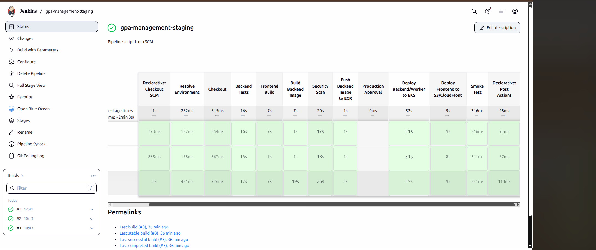
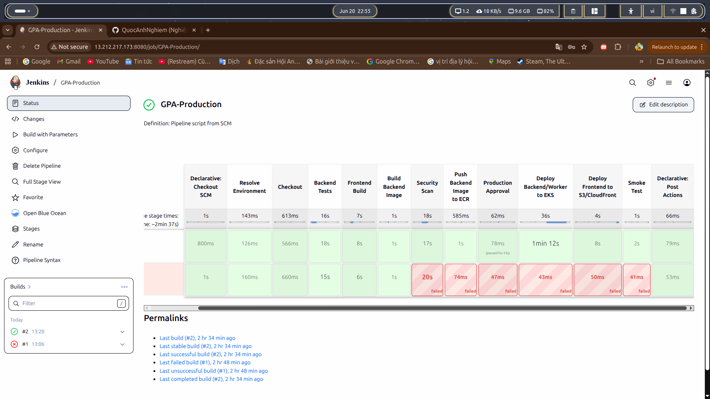

# Jenkins CI/CD Deep Dive

This document explains the Jenkins pipeline and how it deploys staging and production.

## Pipeline Diagram


## CI/CD Flow

```text
Developer
  |
  v
GitHub
  |
  v
Jenkins on EC2
  |
  +--> Checkout
  +--> Resolve environment
  +--> Backend tests
  +--> Frontend build
  +--> Backend Docker build
  +--> Trivy security scan
  +--> Push image to ECR
  +--> Production approval
  +--> Deploy backend/worker to EKS
  +--> Deploy frontend to S3/CloudFront
  +--> Smoke test
```

## Jenkins Infrastructure

Jenkins runs on an EC2 instance instead of a local laptop. That makes the pipeline closer to a real CI/CD runner:

- Jenkins has an IAM role attached to the EC2 instance.
- No AWS access key is hard-coded in the Jenkinsfile.
- Jenkins can call ECR, EKS, S3, and CloudFront through AWS CLI.
- Docker is used to build backend images and run Trivy.
- `kubectl` is used to deploy to EKS.

## Branch And Environment Rules

The pipeline protects environments with branch rules:

| Git source | Deploy target | Behavior |
| --- | --- | --- |
| `staging` branch | `staging` | Allowed |
| `main` branch | `prod` | Allowed with manual approval |
| `v*` tag | `prod` | Allowed with manual approval |
| `staging` -> `prod` | Blocked | Pipeline fails |
| `main` -> `staging` | Blocked | Pipeline fails |

This prevents accidental production deployment from a staging branch.

## Pipeline Stages

| Stage | Purpose |
| --- | --- |
| Resolve Environment | Maps branch/tag/parameter to staging or production |
| Checkout | Pulls source code from GitHub |
| Backend Tests | Runs Jest tests for backend hardening and API logic |
| Frontend Build | Builds Vite frontend with environment-specific API URL |
| Build Backend Image | Builds Docker image from `source/backend/Dockerfile` |
| Security Scan | Runs Trivy HIGH/CRITICAL vulnerability gate |
| Push Backend Image to ECR | Tags and pushes backend image to private ECR repository |
| Production Approval | Requires a human approval before production deployment |
| Deploy Backend/Worker to EKS | Applies Kubernetes manifests and updates image tag |
| Deploy Frontend to S3/CloudFront | Uploads static frontend and invalidates CDN |
| Smoke Test | Verifies API health after deployment |

## Image Tagging

The backend image uses Git commit SHA style tags instead of `latest`.

Why:

- Every deployment maps back to source code.
- Rollback can target a known image tag.
- Jenkins and EKS state can be audited.
- Production does not depend on mutable tags.

## Production Approval

Production deploys pause at the approval stage. This is important because:

- It prevents accidental release from automatic triggers.
- The operator can check staging first.
- It mirrors real release-control workflows.

## Real Jenkins Evidence

Staging pipeline:



Production pipeline:



The production screenshot intentionally shows a previous failed build and a later successful build. That is useful in the detailed CI/CD documentation because it demonstrates debugging and recovery, while the README keeps only the cleaner generated pipeline diagram.

## Jenkins Screenshot Guide

Save as:

```text
docs/screenshot/jenkins-prod-success.png
```

Recommended screenshot:

- Jenkins production job page.
- Full pipeline view visible.
- Green/success stages from checkout to smoke test.
- Manual approval stage visible.

