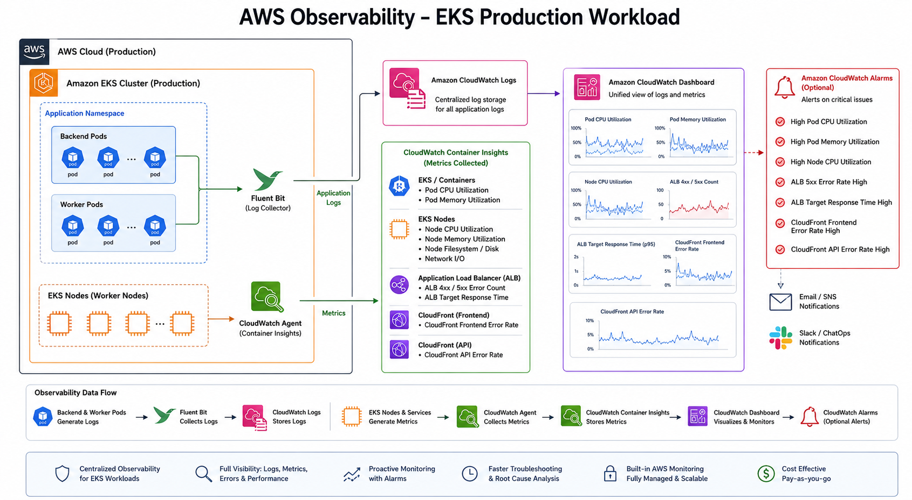
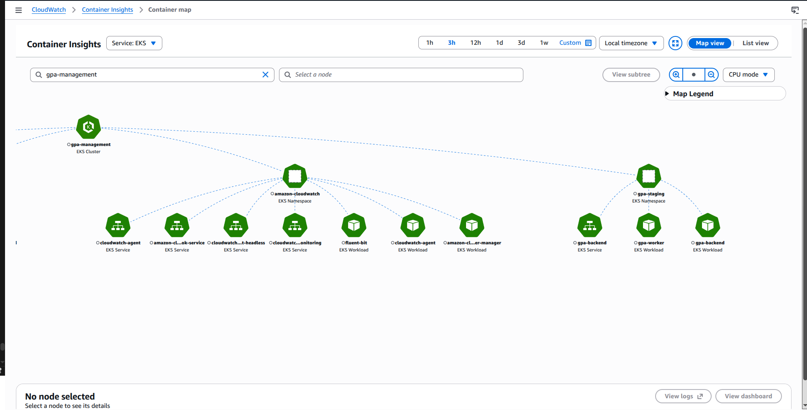
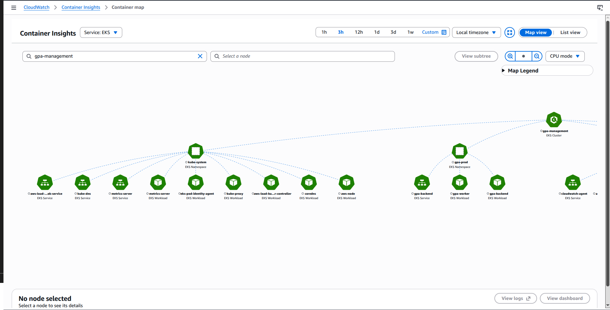

# Monitoring And Logging Deep Dive

This document explains how observability is configured for the EKS deployment.

## Observability Diagram



## Monitoring Stack

The project uses AWS-native observability:

```text
EKS pods/nodes
  |
  +--> CloudWatch Agent -> Container Insights metrics
  |
  +--> Fluent Bit -> CloudWatch Logs
  |
  v
CloudWatch Dashboard
```

## CloudWatch Components

| Component | Purpose |
| --- | --- |
| CloudWatch Observability EKS add-on | Installs CloudWatch agent and logging components |
| CloudWatch Agent | Collects container/node metrics |
| Fluent Bit | Ships application/container logs to CloudWatch Logs |
| Container Insights | Provides EKS pod/node metrics |
| CloudWatch Logs | Centralized app and infrastructure logs |
| CloudWatch Dashboard | Visualizes production health |

## Log Groups

Main log groups:

```text
/aws/containerinsights/gpa-management/application
/aws/containerinsights/gpa-management/dataplane
/aws/containerinsights/gpa-management/host
/aws/containerinsights/gpa-management/performance
```

Use this log group first for backend/worker logs:

```text
/aws/containerinsights/gpa-management/application
```

## Key Metrics

| Metric | Why it matters |
| --- | --- |
| Pod CPU utilization | Detects CPU pressure and scaling needs |
| Pod memory utilization | Detects memory leaks or undersized pods |
| Pod restart count | Detects CrashLoop or unstable rollout |
| ALB 4xx/5xx | Detects client/API/server errors |
| ALB target response time | Detects backend latency |
| CloudFront error rate | Detects edge/API/frontend issues |

## CloudWatch Dashboard


Dashboard widgets:

- EKS `gpa-prod` pod CPU utilization.
- EKS `gpa-prod` pod memory utilization.
- Production ALB HTTP errors.
- Production ALB target response time.
- CloudFront frontend error rate.
- CloudFront API error rate.

Screenshot:

```text
docs/screenshot/cloudwatch-dashboard.png
```

## Container Insights Runtime Map

CloudWatch Container Insights gives a visual map of real EKS namespaces, services, and workloads.

Combined EKS runtime map:


Staging and observability namespaces:



Production and system workloads:



## CloudWatch Logs Evidence


## Useful Logs Insights Queries

Backend logs:

```sql
fields @timestamp, kubernetes.pod_name, kubernetes.container_name, log
| filter kubernetes.namespace_name = "gpa-prod"
| filter kubernetes.container_name = "gpa-backend"
| sort @timestamp desc
| limit 50
```

Worker logs:

```sql
fields @timestamp, kubernetes.pod_name, kubernetes.container_name, log
| filter kubernetes.namespace_name = "gpa-prod"
| filter kubernetes.container_name = "gpa-worker"
| sort @timestamp desc
| limit 50
```

Errors:

```sql
fields @timestamp, kubernetes.pod_name, kubernetes.container_name, log
| filter kubernetes.namespace_name = "gpa-prod"
| filter log like /error|Error|ERROR|failed|Failed|MongoDB|JWT|OAuth/
| sort @timestamp desc
| limit 100
```

Startup and database connection:

```sql
fields @timestamp, kubernetes.pod_name, kubernetes.container_name, log
| filter kubernetes.namespace_name = "gpa-prod"
| filter log like /MongoDB|Server Backend|production/
| sort @timestamp desc
| limit 50
```
